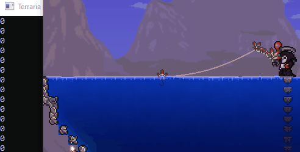

# TerrariaFishingBot
Fishing bot for Terraria

## HOW TO USE:
1. Run Terraria, equip fishing pole and stand near water.
2. Open TerrariaFishingBot.exe.
3. Press "Enter" on keyboard to start fishing bot.
4. Get back to game and aim your mouse to water.
5. Fishing bot will automatically start fishing.

## HOW DOES IT WORK?
I am using library VAMemory, which is very helpful when reading/writing to memory. 

I used cheat engine to find bool that is **true** when fish is being caught **(0 = false, 1-255 = true)** 

Then I had to find static pointer **0x00159B24** and offset **0x170** to adress of that bool using pointer scan.

Now we know when fish is being caught, so we just use Click() method to reel in.
